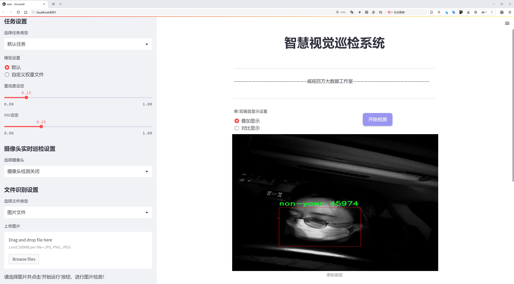
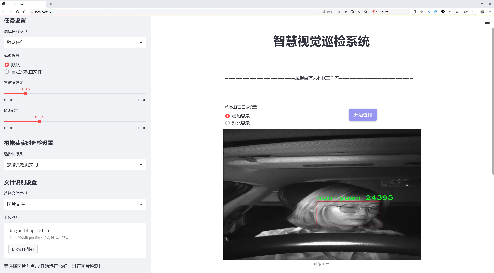
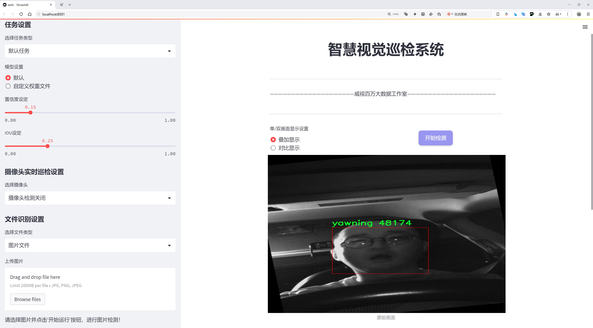
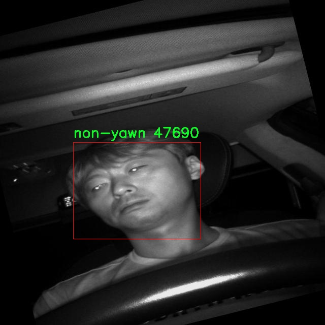
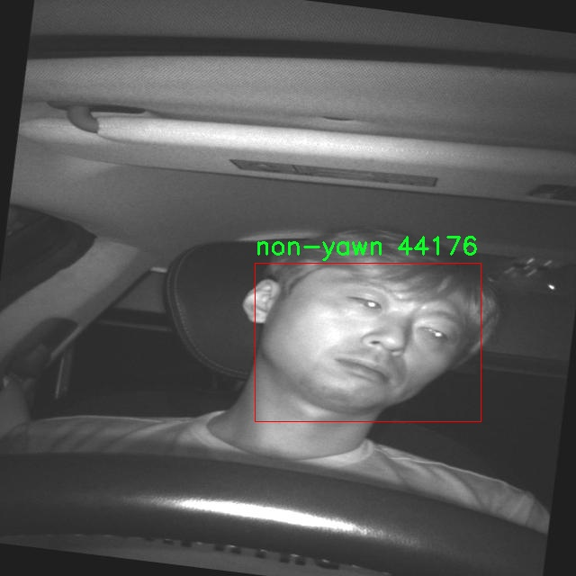
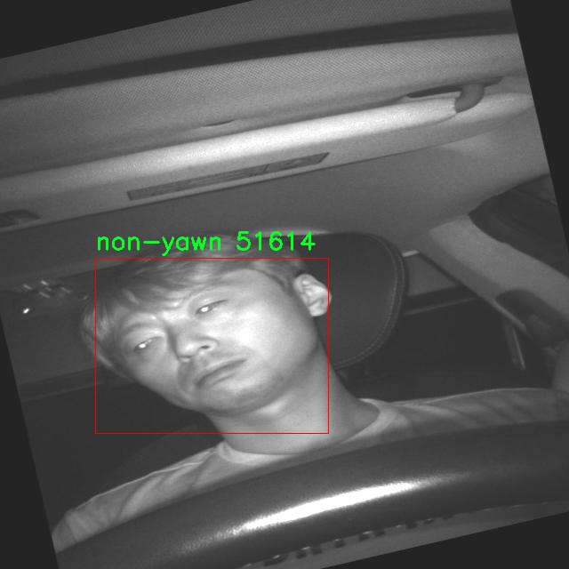
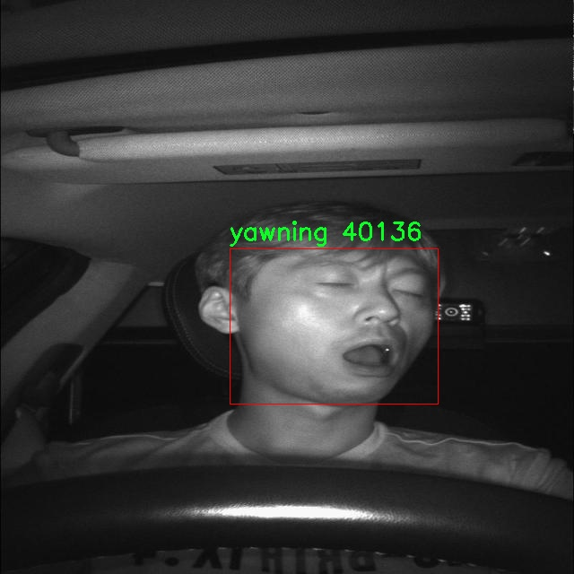
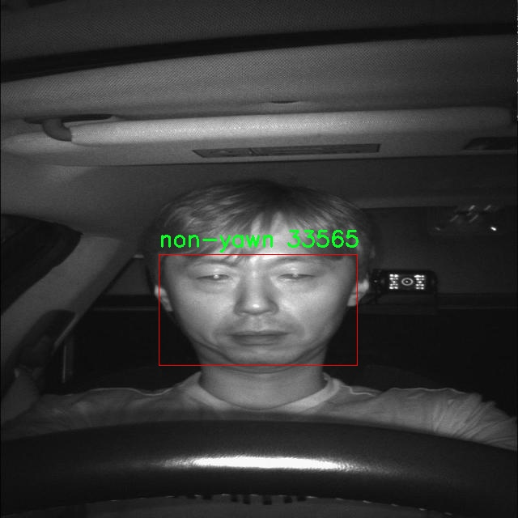

# 疲劳驾驶行为检测检测系统源码分享
 # [一条龙教学YOLOV8标注好的数据集一键训练_70+全套改进创新点发刊_Web前端展示]

### 1.研究背景与意义

项目参考[AAAI Association for the Advancement of Artificial Intelligence](https://gitee.com/qunmasj/projects)

研究背景与意义

随着社会经济的快速发展和交通运输业的蓬勃兴起，疲劳驾驶已成为影响道路安全的重要因素之一。根据相关统计数据，疲劳驾驶导致的交通事故频发，给社会带来了巨大的经济损失和人身伤害。因此，开发有效的疲劳驾驶行为检测系统显得尤为重要。传统的疲劳驾驶检测方法多依赖于驾驶员的自我报告或生理监测，存在一定的主观性和局限性。近年来，计算机视觉和深度学习技术的迅猛发展为疲劳驾驶行为的自动检测提供了新的思路和方法。

在众多深度学习模型中，YOLO（You Only Look Once）系列因其高效的实时目标检测能力而受到广泛关注。YOLOv8作为该系列的最新版本，进一步提升了检测精度和速度，适合在复杂的驾驶环境中应用。然而，针对疲劳驾驶行为的特定需求，YOLOv8的标准模型可能无法充分满足实际应用中的准确性和可靠性。因此，基于改进YOLOv8的疲劳驾驶行为检测系统的研究具有重要的理论和实践意义。

本研究将利用名为“yawnproject”的数据集，该数据集包含7359张图像，分为“non-yawn”和“yawning”两个类别。这一数据集的构建为疲劳驾驶行为的检测提供了丰富的样本支持。通过对这些图像进行标注和分类，可以有效训练深度学习模型，使其具备识别驾驶员疲劳状态的能力。特别是在实际驾驶场景中，驾驶员的面部表情变化往往是疲劳的直接表现，而数据集中“yawning”类别的图像正是捕捉到这一关键行为的有效资源。

在本研究中，我们将对YOLOv8进行改进，结合数据集的特点，优化模型的结构和参数设置，以提高其在疲劳驾驶行为检测中的性能。具体而言，我们将通过数据增强、迁移学习等技术手段，提升模型对不同光照、角度和背景下的鲁棒性。此外，针对疲劳驾驶行为的实时检测需求，我们还将探索模型的轻量化设计，以确保其在实际应用中的高效性和可行性。

本研究的意义不仅在于推动疲劳驾驶检测技术的发展，更在于为智能交通系统的安全性提供技术支持。通过实现对疲劳驾驶行为的精准识别，可以为驾驶员提供及时的警示，降低交通事故的发生率，保障道路安全。同时，该研究也为相关领域的研究者提供了新的思路和方法，促进计算机视觉与交通安全领域的交叉融合。

综上所述，基于改进YOLOv8的疲劳驾驶行为检测系统的研究，既是对当前交通安全问题的积极回应，也是对深度学习技术应用于实际场景的有益探索。通过构建高效、准确的检测系统，我们期待能够为减少疲劳驾驶带来的危害贡献一份力量。

### 2.图片演示







##### 注意：由于此博客编辑较早，上面“2.图片演示”和“3.视频演示”展示的系统图片或者视频可能为老版本，新版本在老版本的基础上升级如下：（实际效果以升级的新版本为准）

  （1）适配了YOLOV8的“目标检测”模型和“实例分割”模型，通过加载相应的权重（.pt）文件即可自适应加载模型。

  （2）支持“图片识别”、“视频识别”、“摄像头实时识别”三种识别模式。

  （3）支持“图片识别”、“视频识别”、“摄像头实时识别”三种识别结果保存导出，解决手动导出（容易卡顿出现爆内存）存在的问题，识别完自动保存结果并导出到。

  （4）支持Web前端系统中的标题、背景图等自定义修改，后面提供修改教程。

  另外本项目提供训练的数据集和训练教程,暂不提供权重文件（best.pt）,需要您按照教程进行训练后实现图片演示和Web前端界面演示的效果。

### 3.视频演示

[3.1 视频演示](https://www.bilibili.com/video/BV1T8sHeFE1L/?vd_source=ff015de2d29cbe2a9cdbfa7064407a08)

### 4.数据集信息展示

数据集信息展示

在本研究中，我们采用了名为“yawnproject”的数据集，以改进YOLOv8的疲劳驾驶行为检测系统。该数据集专注于识别驾驶员的疲劳状态，具体通过监测打哈欠的行为来实现。数据集包含7359张图像，涵盖了两个主要类别：非打哈欠（non-yawn）和打哈欠（yawning）。这些图像的多样性和丰富性为模型的训练提供了坚实的基础，确保了在不同场景和条件下的有效性。

“yawnproject”数据集的设计旨在捕捉驾驶员在不同环境下的打哈欠行为，进而为疲劳驾驶的早期预警提供支持。数据集中包含的图像不仅涵盖了各种光照条件、角度和背景，还包括了不同性别和年龄段的驾驶员。这种多样性确保了模型在实际应用中的广泛适应性，能够有效识别不同人群中的疲劳表现。

在数据集的标注过程中，采用了精确的标注方法，以确保每张图像的类别标签准确无误。标注团队通过严格的审核流程，确保每个图像都被正确分类为“非打哈欠”或“打哈欠”。这种高质量的标注对于训练深度学习模型至关重要，因为它直接影响到模型的学习效果和最终的检测精度。

该数据集的使用遵循CC BY 4.0许可证，这意味着研究人员可以自由使用、修改和分发数据集，只需在使用时给予适当的署名。这种开放的许可证政策促进了学术界和工业界的合作，使得更多的研究者能够利用这一宝贵资源来推动疲劳驾驶检测技术的发展。

在训练YOLOv8模型时，我们将“yawnproject”数据集作为主要的训练集，利用其丰富的图像数据和明确的类别划分，旨在提高模型对疲劳驾驶行为的检测能力。YOLOv8作为一种先进的目标检测模型，具有快速和高效的特性，能够在实时监控系统中应用。通过结合“yawnproject”数据集的训练，我们期望能够显著提升模型在复杂驾驶环境中的表现，从而为减少因疲劳驾驶导致的交通事故提供有效的技术支持。

此外，为了进一步验证模型的有效性，我们还计划在多个真实场景中进行测试，以评估其在不同驾驶条件下的表现。这一过程将帮助我们识别模型的潜在不足之处，并为后续的改进提供数据支持。通过不断迭代和优化，我们希望最终能够开发出一个可靠的疲劳驾驶行为检测系统，为驾驶安全提供保障。

总之，“yawnproject”数据集为我们的研究提供了重要的基础，凭借其丰富的图像资源和高质量的标注，助力我们在疲劳驾驶检测领域的探索与创新。我们期待通过本研究的深入，能够为驾驶安全技术的发展贡献一份力量。











### 5.全套项目环境部署视频教程（零基础手把手教学）

[5.1 环境部署教程链接（零基础手把手教学）](https://www.ixigua.com/7404473917358506534?logTag=c807d0cbc21c0ef59de5)


[5.2 安装Python虚拟环境创建和依赖库安装视频教程链接（零基础手把手教学）](https://www.ixigua.com/7404474678003106304?logTag=1f1041108cd1f708b01a)

### 6.手把手YOLOV8训练视频教程（零基础小白有手就能学会）

[6.1 环境部署教程链接（零基础手把手教学）](https://www.ixigua.com/7404477157818401292?logTag=d31a2dfd1983c9668658)

### 7.70+种全套YOLOV8创新点代码加载调参视频教程（一键加载写好的改进模型的配置文件）

[7.1 环境部署教程链接（零基础手把手教学）](https://www.ixigua.com/7404478314661806627?logTag=29066f8288e3f4eea3a4)

### 8.70+种全套YOLOV8创新点原理讲解（非科班也可以轻松写刊发刊，V10版本正在科研待更新）

由于篇幅限制，每个创新点的具体原理讲解就不一一展开，具体见下列网址中的创新点对应子项目的技术原理博客网址【Blog】：


[8.1 70+种全套YOLOV8创新点原理讲解链接](https://gitee.com/qunmasj/good)

### 9.系统功能展示（检测对象为举例，实际内容以本项目数据集为准）

图1.系统支持检测结果表格显示

  图2.系统支持置信度和IOU阈值手动调节

  图3.系统支持自定义加载权重文件best.pt(需要你通过步骤5中训练获得)

  图4.系统支持摄像头实时识别

  图5.系统支持图片识别

  图6.系统支持视频识别

  图7.系统支持识别结果文件自动保存

  图8.系统支持Excel导出检测结果数据


### 10.原始YOLOV8算法原理

原始YOLOv8算法原理

YOLOv8模型是由Ultralytics团队在2023年1月推出的一款新型目标检测算法，基于YOLOv5的框架，并吸收了近两年内多种经过验证的改进。YOLOv8的设计理念是将目标检测任务视为一个回归问题，通过一个单一的神经网络模型同时预测目标的位置和类别。与之前的YOLO系列模型相比，YOLOv8在精度、速度和模型轻量化方面都取得了显著的提升，尤其适合实时检测的需求。

YOLOv8的网络结构由三个主要部分组成：主干网络（backbone）、特征增强网络（neck）和检测头（head）。在主干网络中，YOLOv8采用了CSP（Cross Stage Partial）结构，旨在提高模型的特征提取能力和计算效率。CSP结构通过将特征图分为多个部分进行处理，能够有效减少计算量，同时保持较高的特征表达能力。

特征增强网络部分，YOLOv8引入了PAN-FPN（Path Aggregation Network - Feature Pyramid Network）的思想，旨在更好地融合不同层次的特征信息。通过这种特征融合，YOLOv8能够在多尺度目标检测中表现出色，尤其是在处理复杂场景时，能够有效提升检测的准确性和鲁棒性。

在检测头部分，YOLOv8采用了解耦头的设计思路，将分类和回归任务分为两个独立的分支。这种解耦的方式使得模型能够更专注于各自的任务，从而解决了复杂场景下定位不准和分类错误的问题。分类任务更关注特征图中提取到的特征与已有类别的相似性，而定位任务则专注于边界框与真实框之间的关系。通过这种设计，YOLOv8在收敛速度和预测精度上都有了显著提升。

值得注意的是，YOLOv8采用了无锚框（Anchor-free）目标检测方法。这一方法摒弃了传统目标检测中需要预先定义锚点框的做法，直接通过回归的方式预测目标的位置和大小。这种设计的优势在于，它减少了锚点框选择和调整的复杂性，使得模型能够更快地聚焦于目标位置的邻近点，从而使得预测框更接近于实际的边界框区域。这一创新使得YOLOv8在处理不同尺度和形状的目标时表现得更加灵活和高效。

在数据增强方面，YOLOv8对Mosaic数据增强进行了调整。尽管Mosaic增强有助于提升模型的鲁棒性和泛化能力，但在训练的最后10个epoch中，YOLOv8选择停止使用该增强方法，以避免对数据真实分布的破坏。这一策略反映了YOLOv8在模型训练过程中对数据质量的重视，旨在提升模型的实际应用效果。

YOLOv8在性能上也取得了显著的成果。根据官方在COCO数据集上的测试结果，YOLOv8在同尺寸模型中实现了更高的mAP（mean Average Precision）值，同时在推理速度上也表现出色。这些性能的提升使得YOLOv8在实时目标检测领域具备了更强的竞争力，尤其适合需要快速响应的应用场景。

总的来说，YOLOv8的设计理念和结构创新使其在目标检测任务中展现出了卓越的性能。通过引入解耦头、无锚框设计以及改进的数据增强策略，YOLOv8不仅提升了检测精度和速度，还在模型的轻量化方面取得了显著进展。这些优势使得YOLOv8在实际应用中具有广泛的研究和应用价值，尤其是在需要实时检测的领域，如自动驾驶、安防监控和智能机器人等。随着YOLOv8的不断发展和优化，其在目标检测领域的影响力将持续扩大，为更多应用场景提供高效、准确的解决方案。


### 11.项目核心源码讲解（再也不用担心看不懂代码逻辑）

#### 11.1 ultralytics\engine\model.py

以下是经过简化和注释的核心代码，保留了YOLO模型的主要功能和结构：

```python
# 导入必要的库
import inspect
import sys
from pathlib import Path
from typing import Union
from ultralytics.nn import nn  # 导入神经网络模块

class Model(nn.Module):
    """
    YOLO模型的基类，统一所有模型的API。

    参数:
        model (str, Path): 要加载或创建的模型文件路径。
        task (Any, optional): YOLO模型的任务类型。默认为None。
    """

    def __init__(self, model: Union[str, Path] = "yolov8n.pt", task=None, verbose=False) -> None:
        """
        初始化YOLO模型。

        参数:
            model (Union[str, Path], optional): 要加载或创建的模型路径或名称。默认为'yolov8n.pt'。
            task (Any, optional): YOLO模型的任务类型。默认为None。
            verbose (bool, optional): 是否启用详细模式。
        """
        super().__init__()
        self.model = None  # 模型对象
        self.task = task  # 任务类型
        self.model_name = str(model).strip()  # 去除空格的模型名称

        # 检查是否为Ultralytics HUB模型
        if self.is_hub_model(model):
            self.session = self._get_hub_session(model)  # 获取HUB会话
            model = self.session.model_file  # 获取模型文件

        # 加载或创建新的YOLO模型
        model = self.check_model_file(model)  # 检查模型文件后缀
        if Path(model).suffix in (".yaml", ".yml"):
            self._new(model, task=task, verbose=verbose)  # 从配置文件创建新模型
        else:
            self._load(model, task=task)  # 从权重文件加载模型

    def _new(self, cfg: str, task=None, model=None, verbose=False):
        """
        从模型定义初始化新模型并推断任务类型。

        参数:
            cfg (str): 模型配置文件
            task (str | None): 模型任务
            model (BaseModel): 自定义模型。
            verbose (bool): 加载时显示模型信息
        """
        cfg_dict = self.yaml_model_load(cfg)  # 加载yaml配置
        self.task = task or self.guess_model_task(cfg_dict)  # 推断任务类型
        self.model = (model or self._smart_load("model"))(cfg_dict, verbose=verbose)  # 创建模型

    def _load(self, weights: str, task=None):
        """
        从权重文件初始化新模型并推断任务类型。

        参数:
            weights (str): 要加载的模型检查点
            task (str | None): 模型任务
        """
        self.model, self.ckpt = self.attempt_load_one_weight(weights)  # 加载权重
        self.task = self.model.args["task"]  # 获取任务类型

    def predict(self, source=None, stream=False, **kwargs):
        """
        使用YOLO模型进行预测。

        参数:
            source (str | int | PIL | np.ndarray): 进行预测的图像源。
            stream (bool): 是否流式传输预测结果。默认为False。

        返回:
            (List[ultralytics.engine.results.Results]): 预测结果。
        """
        if source is None:
            source = "default_source"  # 默认源
        # 设置预测参数
        args = {**self.overrides, **kwargs, "mode": "predict"}
        # 执行预测
        return self.predictor(source=source, stream=stream)

    def is_hub_model(self, model):
        """检查提供的模型是否为HUB模型。"""
        return model.startswith("https://hub.ultralytics.com/models/")

    def _get_hub_session(self, model: str):
        """创建HUB训练会话。"""
        from ultralytics.hub.session import HUBTrainingSession
        session = HUBTrainingSession(model)
        return session if session.client.authenticated else None

    def check_model_file(self, model):
        """检查模型文件后缀并返回完整路径。"""
        # 这里可以添加后缀检查和路径处理逻辑
        return model + ".pt"  # 示例返回值

    def yaml_model_load(self, cfg):
        """加载yaml配置文件。"""
        # 这里可以添加yaml加载逻辑
        return {}  # 示例返回值

    def guess_model_task(self, cfg_dict):
        """推断模型任务类型。"""
        # 这里可以添加任务推断逻辑
        return "default_task"  # 示例返回值

    def attempt_load_one_weight(self, weights):
        """尝试加载权重文件。"""
        # 这里可以添加权重加载逻辑
        return None, None  # 示例返回值

    def _smart_load(self, key):
        """加载模型/训练器/验证器/预测器。"""
        # 这里可以添加智能加载逻辑
        return None  # 示例返回值
```

### 代码说明：
1. **Model类**：这是YOLO模型的核心类，负责模型的初始化、加载和预测等功能。
2. **初始化方法**：根据输入的模型路径或名称，加载相应的模型文件。
3. **_new和_load方法**：分别用于从配置文件和权重文件创建或加载模型。
4. **predict方法**：用于执行模型的预测操作，接受图像源和其他参数。
5. **辅助方法**：包括检查模型文件、加载yaml配置、推断任务类型等。

以上代码是对原始代码的简化和注释，保留了核心功能，便于理解YOLO模型的工作原理。

这个文件是Ultralytics YOLO（You Only Look Once）模型的核心实现之一，主要定义了一个名为`Model`的类，该类统一了所有YOLO模型的API。这个类的构造函数和方法允许用户加载、训练、预测和导出YOLO模型。

在初始化`Model`类时，可以传入模型文件的路径或名称，以及任务类型。构造函数会检查模型的来源，包括是否是从Ultralytics HUB获取的模型，或者是否是Triton Server模型。如果模型文件是以`.yaml`或`.yml`结尾，类会调用`_new`方法来初始化一个新的模型；如果是以`.pt`结尾，则调用`_load`方法来加载已有的模型权重。

`Model`类的主要方法包括：

- `__call__`：这是一个重载的方法，允许用户通过调用模型对象来进行预测。
- `_new`和`_load`：这两个方法分别用于创建新模型和加载已有模型，前者会从配置文件中推断任务类型，后者则从权重文件中获取任务类型。
- `predict`：执行模型的预测，接受多种输入源（如图像路径、视频流等），并返回预测结果。
- `train`：用于训练模型，支持自定义训练器和参数配置。
- `val`：用于在给定数据集上验证模型的性能。
- `export`：将模型导出为不同格式，便于在其他环境中使用。
- `benchmark`：对模型在所有导出格式上的性能进行基准测试。

此外，类中还定义了一些静态方法和属性，用于检查模型的类型、获取设备信息、添加和清除回调等。通过这些方法，用户可以方便地管理和使用YOLO模型。

整个类的设计旨在提供灵活性和可扩展性，使得用户能够根据自己的需求自定义模型的行为。

#### 11.2 ultralytics\utils\callbacks\neptune.py

以下是代码中最核心的部分，并附上详细的中文注释：

```python
# 导入必要的库
from ultralytics.utils import LOGGER, SETTINGS, TESTS_RUNNING

# 尝试导入 NeptuneAI 库并进行初始化
try:
    assert not TESTS_RUNNING  # 确保不是在测试环境中
    assert SETTINGS["neptune"] is True  # 确保 Neptune 集成已启用
    import neptune
    from neptune.types import File

    assert hasattr(neptune, "__version__")  # 确保 Neptune 库版本存在

    run = None  # NeptuneAI 实验记录实例

except (ImportError, AssertionError):
    neptune = None  # 如果导入失败，设置 neptune 为 None


def _log_scalars(scalars, step=0):
    """将标量数据记录到 NeptuneAI 实验记录器中。"""
    if run:  # 如果 run 已初始化
        for k, v in scalars.items():  # 遍历标量字典
            run[k].append(value=v, step=step)  # 记录每个标量值


def _log_images(imgs_dict, group=""):
    """将图像记录到 NeptuneAI 实验记录器中。"""
    if run:  # 如果 run 已初始化
        for k, v in imgs_dict.items():  # 遍历图像字典
            run[f"{group}/{k}"].upload(File(v))  # 上传每个图像文件


def on_pretrain_routine_start(trainer):
    """在训练例程开始前调用的回调函数。"""
    try:
        global run  # 声明 run 为全局变量
        # 初始化 Neptune 运行实例
        run = neptune.init_run(project=trainer.args.project or "YOLOv8", name=trainer.args.name, tags=["YOLOv8"])
        # 记录超参数配置
        run["Configuration/Hyperparameters"] = {k: "" if v is None else v for k, v in vars(trainer.args).items()}
    except Exception as e:
        LOGGER.warning(f"WARNING ⚠️ NeptuneAI 安装但未正确初始化，未记录此运行。 {e}")


def on_train_epoch_end(trainer):
    """每个训练周期结束时调用的回调函数。"""
    # 记录训练损失和学习率
    _log_scalars(trainer.label_loss_items(trainer.tloss, prefix="train"), trainer.epoch + 1)
    _log_scalars(trainer.lr, trainer.epoch + 1)
    if trainer.epoch == 1:  # 如果是第一个周期
        # 记录训练批次的图像
        _log_images({f.stem: str(f) for f in trainer.save_dir.glob("train_batch*.jpg")}, "Mosaic")


def on_train_end(trainer):
    """训练结束时调用的回调函数。"""
    if run:  # 如果 run 已初始化
        # 记录最终结果，包括混淆矩阵和 PR 曲线
        files = [
            "results.png",
            "confusion_matrix.png",
            "confusion_matrix_normalized.png",
            *(f"{x}_curve.png" for x in ("F1", "PR", "P", "R")),
        ]
        # 过滤存在的文件
        files = [(trainer.save_dir / f) for f in files if (trainer.save_dir / f).exists()]
        for f in files:
            _log_plot(title=f.stem, plot_path=f)  # 记录每个图像
        # 记录最终模型
        run[f"weights/{trainer.args.name or trainer.args.task}/{trainer.best.name}"].upload(File(str(trainer.best)))


# 定义回调函数字典，根据是否成功导入 Neptune 来决定是否使用
callbacks = (
    {
        "on_pretrain_routine_start": on_pretrain_routine_start,
        "on_train_epoch_end": on_train_epoch_end,
        "on_fit_epoch_end": on_fit_epoch_end,
        "on_val_end": on_val_end,
        "on_train_end": on_train_end,
    }
    if neptune
    else {}
)
```

### 代码核心部分说明：
1. **NeptuneAI 初始化**：尝试导入并初始化 NeptuneAI，用于记录实验数据。
2. **日志记录函数**：定义了 `_log_scalars` 和 `_log_images` 函数，用于记录标量数据和图像。
3. **回调函数**：定义了多个回调函数（如 `on_pretrain_routine_start`, `on_train_epoch_end`, `on_train_end`），在训练过程中的不同阶段记录相应的数据。
4. **回调字典**：根据 Neptune 是否成功导入，构建回调函数字典，以便在训练过程中调用。

这个程序文件的主要功能是将训练过程中的各种数据和结果记录到NeptuneAI实验日志中，以便于后续的分析和可视化。文件首先导入了一些必要的模块，并进行了一些基本的设置和检查。

在导入部分，首先检查是否正在运行测试（TESTS_RUNNING），并确保Neptune的集成设置已启用（即SETTINGS["neptune"]为True）。如果这些条件满足，则导入Neptune相关的模块，并创建一个名为`run`的变量，用于存储NeptuneAI实验日志实例。如果导入或检查失败，则将`neptune`设置为None。

接下来，定义了一些私有函数，用于记录不同类型的数据。`_log_scalars`函数用于记录标量数据，比如损失值和学习率；`_log_images`函数用于记录图像数据，例如训练过程中生成的图像；`_log_plot`函数用于记录绘图数据，能够将生成的图像文件上传到Neptune。

然后，定义了一些回调函数，这些函数会在训练的不同阶段被调用。`on_pretrain_routine_start`函数在训练开始前被调用，负责初始化Neptune的实验日志并记录超参数配置。`on_train_epoch_end`函数在每个训练周期结束时被调用，记录训练损失和学习率，并在第一个周期结束时记录训练图像。`on_fit_epoch_end`函数在每个适应周期结束时被调用，记录模型的配置信息和指标。`on_val_end`函数在每次验证结束时被调用，记录验证图像。最后，`on_train_end`函数在训练结束时被调用，记录最终的结果，包括混淆矩阵和PR曲线，并上传最佳模型的权重。

最后，程序将这些回调函数组织成一个字典，只有在Neptune集成可用的情况下才会使用这些回调。这使得在不同的环境中可以灵活地选择是否记录日志。整体来看，这个文件的设计旨在提供一个清晰的接口，将训练过程中的重要信息记录到Neptune，以便于用户进行后续的分析和可视化。

#### 11.3 ui.py

```python
import sys
import subprocess

def run_script(script_path):
    """
    使用当前 Python 环境运行指定的脚本。

    Args:
        script_path (str): 要运行的脚本路径

    Returns:
        None
    """
    # 获取当前 Python 解释器的路径
    python_path = sys.executable

    # 构建运行命令
    command = f'"{python_path}" -m streamlit run "{script_path}"'

    # 执行命令
    result = subprocess.run(command, shell=True)
    if result.returncode != 0:
        print("脚本运行出错。")


# 实例化并运行应用
if __name__ == "__main__":
    # 指定您的脚本路径
    script_path = "web.py"  # 这里直接指定脚本路径

    # 运行脚本
    run_script(script_path)
```

### 代码注释说明：

1. **导入模块**：
   - `import sys`：导入系统相关的模块，用于获取当前 Python 解释器的路径。
   - `import subprocess`：导入子进程模块，用于在 Python 中执行外部命令。

2. **定义函数 `run_script`**：
   - 函数的作用是使用当前的 Python 环境来运行指定的脚本。
   - 参数 `script_path` 是要运行的脚本的路径。

3. **获取 Python 解释器路径**：
   - `python_path = sys.executable`：获取当前 Python 解释器的完整路径。

4. **构建运行命令**：
   - `command = f'"{python_path}" -m streamlit run "{script_path}"'`：构建一个命令字符串，用于运行指定的脚本。这里使用了 `streamlit` 模块来运行 Web 应用。

5. **执行命令**：
   - `result = subprocess.run(command, shell=True)`：使用 `subprocess.run` 执行构建的命令。`shell=True` 允许在 shell 中执行命令。

6. **检查执行结果**：
   - `if result.returncode != 0:`：检查命令的返回码，如果不为 0，表示脚本运行出错，打印错误信息。

7. **主程序入口**：
   - `if __name__ == "__main__":`：确保以下代码只有在直接运行该脚本时才会执行。
   - `script_path = "web.py"`：指定要运行的脚本路径。
   - `run_script(script_path)`：调用 `run_script` 函数来执行指定的脚本。

这个程序文件名为 `ui.py`，其主要功能是使用当前的 Python 环境来运行一个指定的脚本，具体是一个名为 `web.py` 的 Streamlit 应用。

程序首先导入了必要的模块，包括 `sys`、`os` 和 `subprocess`，其中 `sys` 模块用于访问与 Python 解释器相关的变量和函数，`os` 模块提供了与操作系统交互的功能，而 `subprocess` 模块则用于创建新进程、连接到它们的输入/输出/错误管道，并获取它们的返回码。

接下来，程序定义了一个名为 `run_script` 的函数，该函数接受一个参数 `script_path`，表示要运行的脚本的路径。在函数内部，首先获取当前 Python 解释器的路径，这通过 `sys.executable` 实现。然后，构建一个命令字符串，该命令使用 Streamlit 来运行指定的脚本。具体来说，命令的格式是 `"{python_path}" -m streamlit run "{script_path}"`，其中 `{python_path}` 和 `{script_path}` 会被实际的路径替换。

随后，使用 `subprocess.run` 方法执行构建好的命令。这个方法会在一个新的 shell 中运行命令，并等待命令执行完成。如果命令的返回码不为 0，表示脚本运行出错，程序会打印出相应的错误信息。

在文件的最后部分，程序通过 `if __name__ == "__main__":` 语句来确保只有在直接运行该脚本时才会执行后面的代码。在这里，首先调用 `abs_path` 函数来获取 `web.py` 的绝对路径，然后调用 `run_script` 函数来运行这个脚本。

总体而言，这个程序的主要作用是简化运行 Streamlit 应用的过程，确保用户可以方便地启动指定的 Python 脚本。

#### 11.4 ultralytics\utils\ops.py

以下是代码中最核心的部分，并附上详细的中文注释：

```python
import torch
import torchvision

def non_max_suppression(
    prediction,
    conf_thres=0.25,
    iou_thres=0.45,
    classes=None,
    agnostic=False,
    multi_label=False,
    labels=(),
    max_det=300,
    nc=0,  # 类别数量（可选）
    max_time_img=0.05,
    max_nms=30000,
    max_wh=7680,
    rotated=False,
):
    """
    对一组边界框执行非最大抑制（NMS），支持掩码和每个框多个标签。

    参数：
        prediction (torch.Tensor): 形状为 (batch_size, num_classes + 4 + num_masks, num_boxes) 的张量，
            包含预测的框、类别和掩码。张量格式应与模型输出格式一致，例如 YOLO。
        conf_thres (float): 置信度阈值，低于该值的框将被过滤。有效值在 0.0 和 1.0 之间。
        iou_thres (float): IoU 阈值，低于该值的框将在 NMS 过程中被过滤。有效值在 0.0 和 1.0 之间。
        classes (List[int]): 要考虑的类别索引列表。如果为 None，则考虑所有类别。
        agnostic (bool): 如果为 True，模型对类别数量不敏感，所有类别将被视为一个类别。
        multi_label (bool): 如果为 True，每个框可能有多个标签。
        labels (List[List[Union[int, float, torch.Tensor]]]): 列表的列表，每个内部列表包含给定图像的先验标签。
        max_det (int): NMS 后要保留的最大框数量。
        nc (int, optional): 模型输出的类别数量。任何在此之后的索引将被视为掩码。
        max_time_img (float): 处理一张图像的最大时间（秒）。
        max_nms (int): 传递给 torchvision.ops.nms() 的最大框数量。
        max_wh (int): 框的最大宽度和高度（像素）。

    返回：
        (List[torch.Tensor]): 长度为 batch_size 的列表，每个元素是形状为 (num_boxes, 6 + num_masks) 的张量，
            包含保留的框，列为 (x1, y1, x2, y2, confidence, class, mask1, mask2, ...)。
    """

    # 检查置信度和IoU阈值的有效性
    assert 0 <= conf_thres <= 1, f"无效的置信度阈值 {conf_thres}, 有效值在 0.0 和 1.0 之间"
    assert 0 <= iou_thres <= 1, f"无效的IoU {iou_thres}, 有效值在 0.0 和 1.0 之间"
    
    # 如果预测是列表或元组（YOLOv8模型在验证模型中，输出 = (推理输出, 损失输出)）
    if isinstance(prediction, (list, tuple)):
        prediction = prediction[0]  # 选择仅推理输出

    bs = prediction.shape[0]  # 批量大小
    nc = nc or (prediction.shape[1] - 4)  # 类别数量
    nm = prediction.shape[1] - nc - 4  # 掩码数量
    mi = 4 + nc  # 掩码起始索引
    xc = prediction[:, 4:mi].amax(1) > conf_thres  # 候选框

    # 设置
    time_limit = 0.5 + max_time_img * bs  # 超过此时间限制则退出
    multi_label &= nc > 1  # 如果类别数量大于1，则允许每个框有多个标签

    prediction = prediction.transpose(-1, -2)  # 转置张量
    if not rotated:
        prediction[..., :4] = xywh2xyxy(prediction[..., :4])  # xywh 转为 xyxy

    t = time.time()  # 记录开始时间
    output = [torch.zeros((0, 6 + nm), device=prediction.device)] * bs  # 初始化输出
    for xi, x in enumerate(prediction):  # 遍历每张图像的推理结果
        x = x[xc[xi]]  # 根据置信度筛选框

        # 如果没有框，继续处理下一张图像
        if not x.shape[0]:
            continue

        # 拆分出框、类别和掩码
        box, cls, mask = x.split((4, nc, nm), 1)

        if multi_label:
            i, j = torch.where(cls > conf_thres)  # 获取符合置信度的索引
            x = torch.cat((box[i], x[i, 4 + j, None], j[:, None].float(), mask[i]), 1)  # 合并框和标签
        else:  # 仅保留最佳类别
            conf, j = cls.max(1, keepdim=True)
            x = torch.cat((box, conf, j.float(), mask), 1)[conf.view(-1) > conf_thres]

        # 根据类别筛选框
        if classes is not None:
            x = x[(x[:, 5:6] == torch.tensor(classes, device=x.device)).any(1)]

        n = x.shape[0]  # 当前框的数量
        if not n:  # 如果没有框，继续处理下一张图像
            continue
        if n > max_nms:  # 如果框的数量超过最大限制
            x = x[x[:, 4].argsort(descending=True)[:max_nms]]  # 按置信度排序并移除多余框

        # 批量NMS
        c = x[:, 5:6] * (0 if agnostic else max_wh)  # 类别偏移
        scores = x[:, 4]  # 置信度
        boxes = x[:, :4] + c  # 框（按类别偏移）
        i = torchvision.ops.nms(boxes, scores, iou_thres)  # 执行NMS
        i = i[:max_det]  # 限制检测框数量

        output[xi] = x[i]  # 保存结果
        if (time.time() - t) > time_limit:  # 检查时间限制
            break  # 超过时间限制，退出

    return output  # 返回最终的检测结果
```

### 代码核心部分说明：
1. **非最大抑制（NMS）**：这是目标检测中常用的后处理步骤，用于去除冗余的重叠框，只保留置信度最高的框。
2. **参数说明**：函数的参数包括置信度阈值、IoU阈值、类别过滤等，允许用户根据需求调整。
3. **框的处理**：根据置信度筛选框，并根据类别进行进一步筛选。
4. **时间限制**：为处理每张图像设置了时间限制，避免处理时间过长。
5. **返回结果**：最终返回每张图像的检测结果，包括框的坐标、置信度和类别信息。

这个程序文件是Ultralytics YOLO模型的一部分，主要包含了一些用于图像处理和目标检测的工具函数和类。以下是对文件中主要内容的讲解。

首先，文件引入了一些必要的库，包括`contextlib`、`math`、`re`、`time`、`cv2`、`numpy`、`torch`等。这些库提供了时间管理、数学计算、正则表达式处理、图像处理、数组操作和深度学习相关的功能。

文件中定义了一个`Profile`类，用于性能分析。这个类可以作为装饰器或上下文管理器使用，能够记录代码块的执行时间。初始化时可以设置初始时间和设备（如CPU或GPU），并在进入和退出上下文时记录时间差。

接下来，文件中定义了一些函数，主要用于处理边界框和分割掩码。`segment2box`函数将分割标签转换为边界框标签，`scale_boxes`函数用于根据不同图像的尺寸重新缩放边界框。`make_divisible`函数用于确保数字可以被指定的除数整除，通常用于网络结构中的通道数调整。

`nms_rotated`和`non_max_suppression`函数实现了非极大值抑制（NMS），用于去除重叠的边界框。`clip_boxes`和`clip_coords`函数则用于将边界框和坐标限制在图像边界内。

此外，文件中还定义了一些用于坐标转换的函数，如`xyxy2xywh`、`xywh2xyxy`、`xywhn2xyxy`等，这些函数用于在不同的边界框表示法之间进行转换，以适应不同的模型输入和输出格式。

文件还包含了处理掩码的函数，如`process_mask`和`process_mask_upsample`，这些函数将掩码应用于边界框，并可以选择性地对掩码进行上采样，以提高质量。

最后，文件中还有一些辅助函数，如`masks2segments`将掩码转换为分割段，`convert_torch2numpy_batch`将PyTorch张量转换为NumPy数组，`clean_str`用于清理字符串中的特殊字符。

整体而言，这个文件提供了一系列用于目标检测和图像处理的实用工具，支持YOLO模型的推理和后处理步骤。

#### 11.5 ultralytics\utils\loss.py

以下是代码中最核心的部分，并附上详细的中文注释：

```python
import torch
import torch.nn as nn
import torch.nn.functional as F

class VarifocalLoss(nn.Module):
    """
    Varifocal loss 由 Zhang 等人提出，主要用于目标检测任务。
    参考文献: https://arxiv.org/abs/2008.13367
    """

    def __init__(self):
        """初始化 VarifocalLoss 类。"""
        super().__init__()

    @staticmethod
    def forward(pred_score, gt_score, label, alpha=0.75, gamma=2.0):
        """计算 Varifocal 损失。"""
        # 计算权重
        weight = alpha * pred_score.sigmoid().pow(gamma) * (1 - label) + gt_score * label
        with torch.cuda.amp.autocast(enabled=False):
            # 计算损失
            loss = (
                (F.binary_cross_entropy_with_logits(pred_score.float(), gt_score.float(), reduction="none") * weight)
                .mean(1)
                .sum()
            )
        return loss


class BboxLoss(nn.Module):
    """用于计算训练过程中的边界框损失的类。"""

    def __init__(self, reg_max, use_dfl=False):
        """初始化 BboxLoss 模块，设置最大正则化和 DFL 设置。"""
        super().__init__()
        self.reg_max = reg_max  # 最大正则化
        self.use_dfl = use_dfl  # 是否使用 DFL

    def forward(self, pred_dist, pred_bboxes, anchor_points, target_bboxes, target_scores, target_scores_sum, fg_mask):
        """计算 IoU 损失。"""
        weight = target_scores.sum(-1)[fg_mask].unsqueeze(-1)  # 计算权重
        iou = bbox_iou(pred_bboxes[fg_mask], target_bboxes[fg_mask], xywh=False, CIoU=True)  # 计算 IoU
        loss_iou = ((1.0 - iou) * weight).sum() / target_scores_sum  # 计算 IoU 损失

        # DFL 损失
        if self.use_dfl:
            target_ltrb = bbox2dist(anchor_points, target_bboxes, self.reg_max)  # 转换目标边界框
            loss_dfl = self._df_loss(pred_dist[fg_mask].view(-1, self.reg_max + 1), target_ltrb[fg_mask]) * weight
            loss_dfl = loss_dfl.sum() / target_scores_sum
        else:
            loss_dfl = torch.tensor(0.0).to(pred_dist.device)

        return loss_iou, loss_dfl  # 返回 IoU 损失和 DFL 损失

    @staticmethod
    def _df_loss(pred_dist, target):
        """返回左侧和右侧 DFL 损失的总和。"""
        tl = target.long()  # 目标左侧
        tr = tl + 1  # 目标右侧
        wl = tr - target  # 左侧权重
        wr = 1 - wl  # 右侧权重
        return (
            F.cross_entropy(pred_dist, tl.view(-1), reduction="none").view(tl.shape) * wl
            + F.cross_entropy(pred_dist, tr.view(-1), reduction="none").view(tl.shape) * wr
        ).mean(-1, keepdim=True)  # 计算 DFL 损失


class v8DetectionLoss:
    """用于计算训练损失的类。"""

    def __init__(self, model):  # model 必须是去并行化的
        """初始化 v8DetectionLoss，定义与模型相关的属性和 BCE 损失函数。"""
        device = next(model.parameters()).device  # 获取模型设备
        h = model.args  # 超参数

        m = model.model[-1]  # Detect() 模块
        self.bce = nn.BCEWithLogitsLoss(reduction="none")  # 二元交叉熵损失
        self.hyp = h  # 超参数
        self.stride = m.stride  # 模型步幅
        self.nc = m.nc  # 类别数量
        self.no = m.no
        self.reg_max = m.reg_max
        self.device = device

        self.use_dfl = m.reg_max > 1  # 是否使用 DFL

        self.assigner = TaskAlignedAssigner(topk=10, num_classes=self.nc, alpha=0.5, beta=6.0)  # 任务对齐分配器
        self.bbox_loss = BboxLoss(m.reg_max - 1, use_dfl=self.use_dfl).to(device)  # 边界框损失
        self.proj = torch.arange(m.reg_max, dtype=torch.float, device=device)  # 投影

    def __call__(self, preds, batch):
        """计算边界框、类别和 DFL 的损失总和。"""
        loss = torch.zeros(3, device=self.device)  # box, cls, dfl
        feats = preds[1] if isinstance(preds, tuple) else preds  # 获取特征
        pred_distri, pred_scores = torch.cat([xi.view(feats[0].shape[0], self.no, -1) for xi in feats], 2).split(
            (self.reg_max * 4, self.nc), 1
        )  # 分割预测分布和预测分数

        pred_scores = pred_scores.permute(0, 2, 1).contiguous()  # 调整维度
        pred_distri = pred_distri.permute(0, 2, 1).contiguous()  # 调整维度

        dtype = pred_scores.dtype
        batch_size = pred_scores.shape[0]  # 批大小
        imgsz = torch.tensor(feats[0].shape[2:], device=self.device, dtype=dtype) * self.stride[0]  # 图像大小 (h,w)
        anchor_points, stride_tensor = make_anchors(feats, self.stride, 0.5)  # 创建锚点

        # 目标
        targets = torch.cat((batch["batch_idx"].view(-1, 1), batch["cls"].view(-1, 1), batch["bboxes"]), 1)  # 合并目标
        targets = self.preprocess(targets.to(self.device), batch_size, scale_tensor=imgsz[[1, 0, 1, 0]])  # 预处理目标
        gt_labels, gt_bboxes = targets.split((1, 4), 2)  # cls, xyxy
        mask_gt = gt_bboxes.sum(2, keepdim=True).gt_(0)  # 生成掩码

        # Pboxes
        pred_bboxes = self.bbox_decode(anchor_points, pred_distri)  # 解码预测边界框

        _, target_bboxes, target_scores, fg_mask, _ = self.assigner(
            pred_scores.detach().sigmoid(),
            (pred_bboxes.detach() * stride_tensor).type(gt_bboxes.dtype),
            anchor_points * stride_tensor,
            gt_labels,
            gt_bboxes,
            mask_gt,
        )  # 分配目标

        target_scores_sum = max(target_scores.sum(), 1)  # 计算目标分数总和

        # 类别损失
        loss[1] = self.bce(pred_scores, target_scores.to(dtype)).sum() / target_scores_sum  # BCE 损失

        # 边界框损失
        if fg_mask.sum():
            target_bboxes /= stride_tensor  # 标准化目标边界框
            loss[0], loss[2] = self.bbox_loss(
                pred_distri, pred_bboxes, anchor_points, target_bboxes, target_scores, target_scores_sum, fg_mask
            )  # 计算边界框损失

        loss[0] *= self.hyp.box  # 边界框增益
        loss[1] *= self.hyp.cls  # 类别增益
        loss[2] *= self.hyp.dfl  # DFL 增益

        return loss.sum() * batch_size, loss.detach()  # 返回总损失和损失的副本
```

以上代码是 YOLOv8 模型中损失计算的核心部分，包括 Varifocal 损失、边界框损失和整体检测损失的计算。每个类和方法都有详细的中文注释，帮助理解其功能和实现细节。

这个程序文件是Ultralytics YOLO（You Only Look Once）模型中的损失函数实现，主要用于目标检测、实例分割和关键点检测等任务。文件中定义了多个损失类，每个类负责计算特定类型的损失。

首先，`VarifocalLoss`类实现了一种变焦损失函数，基于Zhang等人的研究。它通过对预测得分和真实得分进行加权计算，使用sigmoid函数和二元交叉熵损失来计算最终损失。权重由预测得分、真实得分和标签决定。

接下来，`FocalLoss`类是一个包装类，用于实现焦点损失。焦点损失通过对交叉熵损失进行调制，来减小易分类样本的损失，从而关注难分类样本。该类允许设置两个参数：`gamma`和`alpha`，分别控制调制因子的强度和样本的平衡。

`BboxLoss`类计算边界框的损失，使用IoU（Intersection over Union）作为基础损失。它还支持DFL（Distribution Focal Loss），用于进一步优化边界框的预测。该类的`forward`方法计算IoU损失和DFL损失，并返回这两个损失的值。

`RotatedBboxLoss`类是`BboxLoss`的子类，专门用于处理旋转边界框的损失计算。它与`BboxLoss`类似，但使用不同的IoU计算方法，适用于旋转目标检测任务。

`KeypointLoss`类用于计算关键点的损失，基于预测关键点和真实关键点之间的欧几里得距离。它还考虑了关键点的可见性，并根据区域大小进行归一化处理。

`v8DetectionLoss`类是一个综合性的损失类，负责计算目标检测任务中的所有损失，包括边界框损失、分类损失和DFL损失。它初始化时接收模型，并设置相关参数。`__call__`方法用于计算损失，处理输入的预测和目标，并返回总损失。

`v8SegmentationLoss`类继承自`v8DetectionLoss`，并扩展了实例分割任务的损失计算，考虑了分割掩码的损失。

`v8PoseLoss`类专注于姿态估计任务，计算关键点的损失，并使用`KeypointLoss`类来处理关键点的预测和真实值之间的差异。

`v8ClassificationLoss`类用于计算分类任务的损失，使用交叉熵损失函数。

最后，`v8OBBLoss`类实现了针对旋转边界框的损失计算，适用于特定的目标检测任务。

整体而言，这个文件提供了多种损失函数的实现，旨在支持不同的计算机视觉任务，特别是在YOLO模型的训练过程中。每个损失类都有其特定的功能和计算逻辑，确保模型能够有效地学习和优化其性能。

#### 11.6 ultralytics\utils\callbacks\clearml.py

以下是代码中最核心的部分，并附上详细的中文注释：

```python
# 导入必要的库
from ultralytics.utils import LOGGER, SETTINGS, TESTS_RUNNING

# 尝试导入 ClearML 相关的库，并进行基本的检查
try:
    assert not TESTS_RUNNING  # 确保不是在测试环境中
    assert SETTINGS["clearml"] is True  # 确保 ClearML 集成已启用
    import clearml
    from clearml import Task
    from clearml.binding.frameworks.pytorch_bind import PatchPyTorchModelIO
    from clearml.binding.matplotlib_bind import PatchedMatplotlib

    assert hasattr(clearml, "__version__")  # 确保 ClearML 包已正确安装

except (ImportError, AssertionError):
    clearml = None  # 如果导入失败，则将 clearml 设置为 None


def on_pretrain_routine_start(trainer):
    """在预训练例程开始时运行；初始化并连接/记录任务到 ClearML。"""
    try:
        task = Task.current_task()  # 获取当前任务
        if task:
            # 确保自动的 PyTorch 和 Matplotlib 绑定被禁用
            PatchPyTorchModelIO.update_current_task(None)
            PatchedMatplotlib.update_current_task(None)
        else:
            # 初始化一个新的 ClearML 任务
            task = Task.init(
                project_name=trainer.args.project or "YOLOv8",  # 项目名称
                task_name=trainer.args.name,  # 任务名称
                tags=["YOLOv8"],  # 标签
                output_uri=True,
                reuse_last_task_id=False,
                auto_connect_frameworks={"pytorch": False, "matplotlib": False},  # 禁用自动连接
            )
            LOGGER.warning(
                "ClearML Initialized a new task. If you want to run remotely, "
                "please add clearml-init and connect your arguments before initializing YOLO."
            )
        task.connect(vars(trainer.args), name="General")  # 连接训练参数
    except Exception as e:
        LOGGER.warning(f"WARNING ⚠️ ClearML installed but not initialized correctly, not logging this run. {e}")


def on_train_epoch_end(trainer):
    """在 YOLO 训练的每个 epoch 结束时记录调试样本并报告当前训练进度。"""
    task = Task.current_task()  # 获取当前任务
    if task:
        # 记录调试样本（仅在第一个 epoch）
        if trainer.epoch == 1:
            _log_debug_samples(sorted(trainer.save_dir.glob("train_batch*.jpg")), "Mosaic")
        # 报告当前训练进度
        for k, v in trainer.label_loss_items(trainer.tloss, prefix="train").items():
            task.get_logger().report_scalar("train", k, v, iteration=trainer.epoch)  # 记录训练损失
        for k, v in trainer.lr.items():
            task.get_logger().report_scalar("lr", k, v, iteration=trainer.epoch)  # 记录学习率


def on_train_end(trainer):
    """在训练完成时记录最终模型及其名称。"""
    task = Task.current_task()  # 获取当前任务
    if task:
        # 记录最终结果，包括混淆矩阵和 PR 曲线
        files = [
            "results.png",
            "confusion_matrix.png",
            "confusion_matrix_normalized.png",
            *(f"{x}_curve.png" for x in ("F1", "PR", "P", "R")),
        ]
        files = [(trainer.save_dir / f) for f in files if (trainer.save_dir / f).exists()]  # 过滤存在的文件
        for f in files:
            _log_plot(title=f.stem, plot_path=f)  # 记录图像
        # 报告最终指标
        for k, v in trainer.validator.metrics.results_dict.items():
            task.get_logger().report_single_value(k, v)
        # 记录最终模型
        task.update_output_model(model_path=str(trainer.best), model_name=trainer.args.name, auto_delete_file=False)


# 定义回调函数
callbacks = (
    {
        "on_pretrain_routine_start": on_pretrain_routine_start,
        "on_train_epoch_end": on_train_epoch_end,
        "on_train_end": on_train_end,
    }
    if clearml
    else {}
)
```

### 代码说明：
1. **导入和初始化**：首先导入必要的库，并检查 ClearML 是否可用。如果不可用，则将 `clearml` 设置为 `None`。
2. **任务初始化**：在 `on_pretrain_routine_start` 函数中，初始化 ClearML 任务并连接训练参数。
3. **训练过程记录**：在每个训练 epoch 结束时，使用 `on_train_epoch_end` 函数记录调试样本和训练进度。
4. **训练结束记录**：在训练结束时，使用 `on_train_end` 函数记录最终模型和相关指标。
5. **回调函数**：将各个回调函数组织成字典，以便在训练过程中调用。

这个程序文件 `clearml.py` 是用于集成 ClearML 的回调函数，主要用于在 Ultralytics YOLO 模型训练过程中记录和管理训练的各种信息。文件的开头部分导入了一些必要的库和模块，并进行了基础的异常处理，以确保 ClearML 的功能可以正常使用。

在导入部分，首先检查是否在测试模式下运行（`TESTS_RUNNING`），如果是，则不进行日志记录。接着，确认 ClearML 的集成设置是否启用。然后尝试导入 ClearML 相关的模块，包括 `Task`、`PatchPyTorchModelIO` 和 `PatchedMatplotlib`，并确保 ClearML 的版本是有效的。

接下来的几个函数主要用于记录不同阶段的训练信息。`_log_debug_samples` 函数用于将图像文件作为调试样本记录到 ClearML 任务中。它接受文件路径列表和标题作为参数，遍历文件列表并将存在的文件记录为图像，提取批次信息并与图像一起上传。

`_log_plot` 函数用于将保存的图像文件作为绘图记录到 ClearML 的绘图部分。它使用 Matplotlib 加载图像并创建一个无坐标轴的图形，然后将其上传到当前任务的日志中。

`on_pretrain_routine_start` 函数在预训练例程开始时运行，初始化并连接 ClearML 任务。如果当前没有任务，则创建一个新任务，并将训练参数连接到任务中。这个函数还会发出警告，提示用户如果要远程运行，需要在初始化 YOLO 之前添加 ClearML 的初始化命令。

`on_train_epoch_end` 函数在每个训练周期结束时调用，记录调试样本和当前训练进度。如果是第一个周期，则记录调试样本，并报告当前的训练损失和学习率。

`on_fit_epoch_end` 函数在每个适应周期结束时调用，记录模型信息和验证指标。它会记录当前周期的时间和验证指标，并在第一个周期时记录模型的基本信息。

`on_val_end` 函数在验证结束时调用，记录验证结果，包括标签和预测的图像。

`on_train_end` 函数在训练完成时调用，记录最终模型及其名称。它会记录最终的结果，包括混淆矩阵和各种性能曲线，并报告最终的验证指标。最后，它会将最佳模型更新到 ClearML 任务中。

最后，`callbacks` 字典定义了在不同训练阶段调用的回调函数，如果 ClearML 可用，则将相应的函数添加到字典中。这个结构使得在训练过程中能够灵活地记录和管理训练数据。

### 12.系统整体结构（节选）

### 程序整体功能和构架概括

该程序是一个完整的目标检测和计算机视觉框架，主要基于Ultralytics YOLO模型。它包含了模型的定义、训练、损失计算、回调管理、图像处理和用户界面等多个模块。整体架构分为以下几个部分：

1. **模型定义与训练**：`ultralytics\engine\model.py` 定义了YOLO模型的结构和训练流程。
2. **损失计算**：`ultralytics\utils\loss.py` 提供了多种损失函数的实现，用于优化模型性能。
3. **图像处理与操作**：`ultralytics\utils\ops.py` 包含了一些图像处理和边界框操作的工具函数。
4. **回调管理**：`ultralytics\utils\callbacks` 目录下的文件（如 `neptune.py` 和 `clearml.py`）实现了与外部实验管理工具的集成，记录训练过程中的各种信息。
5. **用户界面**：`ui.py` 提供了一个简单的界面，用于启动和运行Streamlit应用。
6. **训练脚本**：`train.py` 是主要的训练入口，负责调用模型、损失函数和回调，执行训练过程。

通过这些模块的协同工作，该程序能够高效地进行目标检测任务，支持训练、验证和推理，并提供了良好的可视化和实验管理功能。

### 文件功能整理表

| 文件路径                                           | 功能描述                                                     |
|---------------------------------------------------|------------------------------------------------------------|
| `ultralytics\engine\model.py`                     | 定义YOLO模型的结构和API，支持模型的加载、训练、预测和导出。 |
| `ultralytics\utils\callbacks\neptune.py`         | 集成Neptune，记录训练过程中的各种数据和结果。              |
| `ui.py`                                           | 提供用户界面，运行指定的Streamlit应用。                     |
| `ultralytics\utils\ops.py`                        | 包含图像处理和边界框操作的工具函数。                        |
| `ultralytics\utils\loss.py`                       | 实现多种损失函数，用于目标检测、实例分割和关键点检测。      |
| `ultralytics\utils\callbacks\clearml.py`         | 集成ClearML，记录训练过程中的信息和结果。                  |
| `ultralytics\nn\modules\conv.py`                 | 定义卷积层和相关操作，用于构建神经网络。                    |
| `ultralytics\utils\triton.py`                    | 提供与Triton Server的集成，支持模型的推理服务。            |
| `ultralytics\models\sam\modules\transformer.py`  | 实现Transformer模块，可能用于特定的模型架构。              |
| `train.py`                                        | 主要训练脚本，负责调用模型、损失函数和回调，执行训练过程。  |

这个表格总结了每个文件的主要功能，帮助理解整个程序的架构和功能模块。

注意：由于此博客编辑较早，上面“11.项目核心源码讲解（再也不用担心看不懂代码逻辑）”中部分代码可能会优化升级，仅供参考学习，完整“训练源码”、“Web前端界面”和“70+种创新点源码”以“13.完整训练+Web前端界面+70+种创新点源码、数据集获取”的内容为准。

### 13.完整训练+Web前端界面+70+种创新点源码、数据集获取


#完整训练+Web前端界面+70+种创新点源码、数据集获取链接

https://mbd.pub/o/bread/ZpqVmZ9p